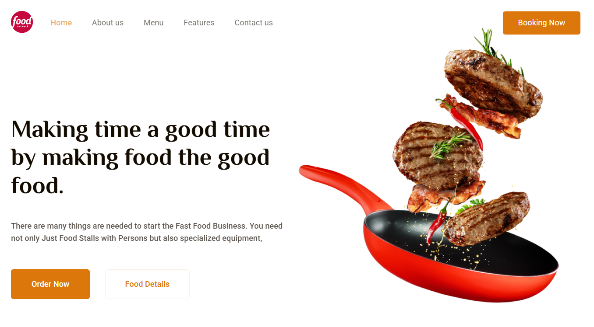

# Food Network

A landing page for a fictional food delivery service showcasing menu highlights, platform features, and a mobile app experience.

> **Project Screenshot**
> 

## Live Demo

**Demo:** https://food-network-bay.vercel.app/

## Overview

Food Network is a modern promotional landing page designed for a food delivery business. The project focuses on responsive design, clean visual hierarchy, and an engaging presentation of products and services.

## Features

- Responsive landing page layout
- Hero section with call-to-action
- About section introducing the service
- Feature highlights
- Food menu showcase
- Mobile app promotion section
- Customer testimonial section
- Contact information and footer

## Tech Stack

- HTML5
- CSS3
- SCSS
- Google Fonts
- Responsive Web Design

## Getting Started

1. Clone the repository.

```bash
git clone https://github.com/Developer-Mykhailo/Food-Network.git
```

2. Open `index.html` in your browser.

## What I Learned

- Building responsive landing pages with semantic HTML
- Structuring styles using SCSS partials
- Creating reusable content sections
- Improving layout composition with Flexbox
- Working with typography, imagery, and modern UI spacing
